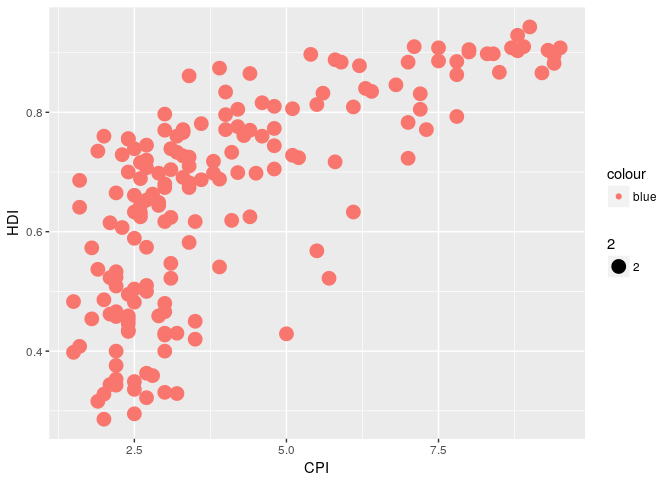

    # install.packages("ggplot2")

Base Graphics
-------------

    housing <- read.csv("Rgraphics/dataSets/landdata-states.csv")
    head(housing[1:5]) # number of columns (from left to right)

    ##   State region    Date Home.Value Structure.Cost
    ## 1    AK   West 2010.25     224952         160599
    ## 2    AK   West 2010.50     225511         160252
    ## 3    AK   West 2009.75     225820         163791
    ## 4    AK   West 2010.00     224994         161787
    ## 5    AK   West 2008.00     234590         155400
    ## 6    AK   West 2008.25     233714         157458

    hist(housing$Home.Value) 

ggplot histogram
----------------

    library(ggplot2)
    ggplot(housing, aes (x = Home.Value)) +
      geom_histogram()

    ## `stat_bin()` using `bins = 30`. Pick better value with `binwidth`.

 \#\#
Base colored scatter plot

    plot(Home.Value ~ Date,
         data=subset(housing, State == "MA"))
    points(Home.Value ~ Date, col="red",
           data=subset(housing, State == "TX"))
    legend(1975, 400000,
           c("MA", "TX"), title="State",
           col=c("black", "red"),
           pch=c(1, 1))

 \#\#
ggplot colored scatter plot

    ggplot(subset(housing, State %in% c("MA", "TX")),
           aes(x=Date,
               y=Home.Value,
               color=State))+
      geom_point()

Points(scatterplot)
-------------------

    help.search("geom_", package = "ggplot2")
    hp2001Q1 <- subset(housing, Date == 2001.25) 
    ggplot(hp2001Q1,
           aes(y = Structure.Cost, x = Land.Value)) +
      geom_point()

ggplot scatterplot
------------------

    ggplot(hp2001Q1,
           aes(y = Structure.Cost, x = log(Land.Value))) +
      geom_point()

 \#\#
Line(prediction line)

    hp2001Q1$pred.SC <- predict(lm(Structure.Cost ~ log(Land.Value), data = hp2001Q1))

    p1 <- ggplot(hp2001Q1, aes(x = log(Land.Value), y = Structure.Cost))

    p1 + geom_point(aes(color = Home.Value)) +
      geom_line(aes(y = pred.SC))

 \#\#
Smoother

    p1 +
      geom_point(aes(color = Home.Value)) +
      geom_smooth()

    ## `geom_smooth()` using method = 'loess'

Text(label points)
------------------

    p1 + 
      geom_text(aes(label = State), size = 3)

\#\#ggpel text(label point)

    # install.packages("ggrepel") 
    library("ggrepel")
    p1 + 
      geom_point() + 
      geom_text_repel(aes(label=State), size = 3)

 \#\#
Aesthetic Mapping VS Assignment

    p1 +
      geom_point(aes(size = 2),# incorrect! 2 is not a variable
                 color="red") # this is fine -- all points red

 \#\#
Mapping Variables To Other Aesthetics

    p1 +
      geom_point(aes(color=Home.Value, shape = region))

    ## Warning: Removed 1 rows containing missing values (geom_point).

 \#\#
Exercise 1

    dat <- read.csv("Rgraphics/dataSets/EconomistData.csv")
    head(dat)

    ##   X     Country HDI.Rank   HDI CPI            Region
    ## 1 1 Afghanistan      172 0.398 1.5      Asia Pacific
    ## 2 2     Albania       70 0.739 3.1 East EU Cemt Asia
    ## 3 3     Algeria       96 0.698 2.9              MENA
    ## 4 4      Angola      148 0.486 2.0               SSA
    ## 5 5   Argentina       45 0.797 3.0          Americas
    ## 6 6     Armenia       86 0.716 2.6 East EU Cemt Asia

    ggplot(dat, aes(x = CPI, y = HDI, size = 2, colour = "blue")) + geom_point()

